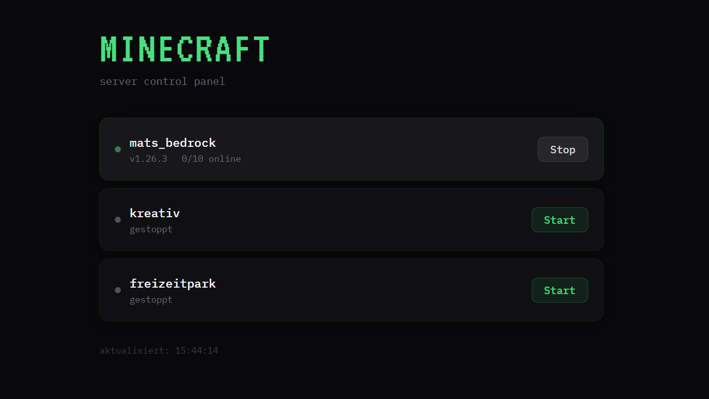

# Minecraft Bedrock Home Control

[](https://hub.docker.com/repository/docker/auswahlkobra23/minecraft-bedrock-home-control/general)

You run one or more Minecraft Bedrock servers at home for your kids. The servers live inside Docker containers or Proxmox LXC containers — because that's the sane way to manage them. But two problems keep coming up:

**Discovery.** Bedrock uses UDP broadcasts on port 19132 to show nearby servers automatically in the client. Those broadcasts don't escape a container's network namespace, so the servers are invisible to players on the LAN — unless you're running directly on the host. You could just add servers manually by IP, but that's extra steps every time a new device shows up, and kids don't want to deal with that.

If you already have a server running directly on the host on port 19132, that one will still show up automatically — no changes needed. This tool only adds visibility for the containerised servers alongside it.

**Idle servers wasting resources.** The servers don't need to run 24/7. After the kids are done playing, they just close the game — the server keeps running, using memory and CPU for nothing. Shutting it down manually means someone has to remember to do it.

This repository solves both problems, depending on your setup:

| Setup | Tool | Folder |
|---|---|---|
| Docker on a Linux host | LAN Broadcaster + Auto-Stop + Web UI | `docker/` |
| Proxmox with LXC containers | Auto-Stop + Web UI | `proxmox/` |

---

## Docker: LAN Broadcaster + Auto-Stop

### How it works

- Listens on UDP 19132 for Bedrock ping packets from LAN clients
- Discovers running Bedrock containers via Docker label (`mc.bedrock=true`)
- Forwards each server's PONG response directly to the client, correcting the port
- Optionally stops idle containers after a configurable timeout (`mc.autostop=true`)
- Optional web interface for starting, stopping and monitoring servers

### Requirements

- Docker with Compose
- Bedrock server containers must have port mappings and labels (see below)

### Setup

**1. Label your Minecraft containers**

```yaml
services:
  my-bedrock-server:
    image: itzg/minecraft-bedrock-server
    ports:
      - "19133:19132/udp"
    environment:
      - EULA=TRUE
    labels:
      mc.bedrock: "true"       # required: enables discovery
      mc.autostop: "true"      # optional: enables auto-stop when empty
    volumes:
      - ./data:/data
```

Each server needs a unique host port (19133, 19134, ...).

**2. Deploy the broadcaster**

Download `docker-compose.yml` and run — no build step needed:

```bash
docker compose up -d
```

Or pull the image manually:

```bash
docker pull auswahlkobra23/minecraft-bedrock-home-control:latest
```

### Web Interface

When `WEB_ENABLED=true`, a control panel is available at `http://your-host:8123` — lists all Bedrock containers (running and stopped), shows player count and version, and allows starting/stopping with one click.



### Configuration

All settings are via environment variables in `docker-compose.yml`:

| Variable | Default | Description |
|---|---|---|
| `LABEL_FILTER` | `mc.bedrock=true` | Label to discover servers |
| `AUTOSTOP_LABEL` | `mc.autostop=true` | Label to enable auto-stop |
| `IDLE_TIMEOUT` | `300` | Seconds before stopping empty server |
| `CHECK_INTERVAL` | `15` | Seconds between player count checks |
| `LISTEN_PORT` | `19132` | UDP port to listen on |
| `WEB_ENABLED` | `true` | Enable or disable the web interface |
| `WEB_PORT` | `8123` | HTTP port for web interface |

---

## Proxmox: Auto-Stop + Web Interface

### How it works

With Proxmox LXC containers, each container gets its own IP address — so Bedrock's LAN discovery works natively without a broadcaster. This tool handles auto-stop and optionally a web interface for server management.

- Discovers LXC containers via Proxmox API using the tag `mc-bedrock`
- Queries player count directly via RakNet UDP ping
- Stops idle containers via the Proxmox API (`mc-autostop` tag)
- Optional web interface for starting, stopping and monitoring servers

### Requirements

- Python 3.10+
- Proxmox API token with `VM.Audit` and `VM.PowerMgmt` on `/vms`

### Setup

**1. Create a Proxmox API token**

In the Proxmox web UI:
- Datacenter → Permissions → API Tokens → Add
- User: create a dedicated user e.g. `autostopper@pve`
- Disable Privilege Separation
- Assign a role with `VM.Audit` + `VM.PowerMgmt` on path `/vms` with Propagate enabled

**2. Tag your LXC containers**

In the Proxmox web UI, set tags on each Minecraft LXC container:
- Container → Options → Tags
- `mc-bedrock` — required: enables discovery
- `mc-autostop` — optional: enables auto-stop when empty

**3. Configure and run**

Edit the configuration block at the top of `proxmox/bedrock_home_control.py`:

```python
PROXMOX_HOST   = "https://localhost:8006"
PROXMOX_NODE   = "your-node-name"   # run: hostname
API_TOKEN_ID   = "autostopper@pve!autostopper"
API_TOKEN_SEC  = "your-token-secret"
IDLE_TIMEOUT   = 300
CHECK_INTERVAL = 15
WEB_ENABLED    = True
WEB_PORT       = 8123
```

Install as a systemd service on the Proxmox node:

```bash
pip install requests
cp bedrock_home_control.py /opt/bedrock_home_control.py

cat > /etc/systemd/system/bedrock-home-control.service << EOF2
[Unit]
Description=Minecraft Bedrock Home Control
After=network.target

[Service]
ExecStart=/usr/bin/python3 /opt/bedrock_home_control.py
Restart=on-failure

[Install]
WantedBy=multi-user.target
EOF2

systemctl daemon-reload
systemctl enable --now bedrock-home-control
```

---

## Repository structure

```
├── README.md
├── docker/
│   ├── bedrock_home_control.py  # LAN Broadcaster + Auto-Stop + Web UI
│   ├── Dockerfile
│   └── docker-compose.yml       # Broadcaster only – add your MC servers separately
└── proxmox/
    └── bedrock_home_control.py  # Auto-Stop + Web UI for Proxmox LXC
```
